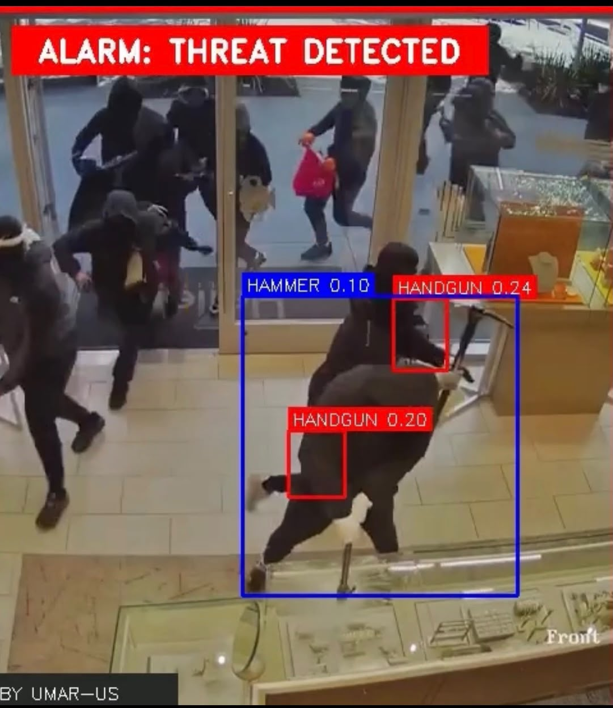

# Multi-Class Firearm & Weapon Detection Pipeline

An end-to-end computer vision pipeline for real-time detection and tracking of firearms and weapons in video streams using YOLO architectures and OpenCV.

## Features
- Real-Time Detection & Tracking: High-FPS inference optimized for surveillance feeds and recorded video streams.
- Multi-Class Weapon Identification: Detects and classifies firearm categories.
- Visual Bounding Boxes: Real-time visual tracking with confidence scores.

## Quick Start
1. Install dependencies:
   pip install -r requirements.txt

2. Run detection script:
   python detect_track_v2.py

